<h1 align="center">Apboa Next</h1>

<p align="center">
  <strong>企业级 AI 智能体平台 — 从定义到生产</strong>
</p>

<p align="center">
  基于 ReAct 范式的多租户智能体构建与运行平台<br/>
  <code>MCP 协议</code> · <code>A2A 协作</code> · <code>多向量存储</code> · <code>一键部署</code>
</p>

<p align="center">
  
  
  
  
  
  
</p>

Apboa Next 是基于ReAct理念的智能体开发与管理平台，旨在简化AI智能体的构建流程，帮助用户快速打造专属数字助手。平台整合了敏感词过滤、提示词管理、多模型接入、工具集成、知识库和智能体编排等核心功能，形成一站式解决方案，架构清晰，易于使用。

## 目录

- [快速开始](#快速开始)
- [本地开发](#本地开发)
- [核心特性](#核心特性)
- [系统架构](#系统架构)
- [为什么选择 Apboa](#为什么选择-apboa)
- [能力清单](#能力清单)
- [技术栈](#技术栈)
- [核心页面预览](#核心页面预览)
- [部署指南](#部署指南)
- [项目结构](#项目结构)
- [贡献指南](#贡献指南)
- [交流与赞助](#交流与赞助)
- [开源协议](#开源协议)
- [Workflow 专题](#workflow-可视化工作流引擎)

## 快速开始

前置条件：Docker Engine 20+ & Docker Compose v2+

```bash
git clone https://gitee.com/studious_tiger/apboa-next.git
cd apboa-next/docker
bash start-simple.sh
```

启动完成后访问 `http://localhost`，默认账号 `admin / Admin@123.com`。

> 单机体验版包含全部 5 个服务 + 3 个中间件，约 5 分钟完成初始化。生产部署请参考 [docker-compose-execute.yml](docker/docker-compose-execute.yml)。

## 本地开发

### 环境要求

| 依赖 | 版本 | 说明 |
|------|------|------|
| JDK | 21+ | 后端编译与运行 |
| Maven | 3.8+ | 后端构建 |
| MySQL | 8.0+ | 主数据库，库名 `apboa_next` |
| Redis | 7+ | 缓存与分布式锁 |
| Node.js | 20.19+ 或 22.12+ | 前端运行 |
| pnpm | 9+ | 前端包管理 |

### 1. 初始化中间件

确保 MySQL 和 Redis 已启动。创建数据库并导入初始化脚本：

```bash
# 创建数据库
mysql -u root -p -e "CREATE DATABASE apboa_next DEFAULT CHARACTER SET utf8mb4 COLLATE utf8mb4_general_ci;"

# 导入表结构与初始数据
mysql -u root -p apboa_next < sql/once_db_init/db_init.sql
```

### 2. 配置后端

各 Runner 模块使用 `application-dev.yml` 作为本地开发配置，部分模块提供了 `application-dev.sample.yml` 模板，复制并按需修改即可。

```bash
# runner-console
cp runner-console/src/main/resources/application-dev.sample.yml runner-console/src/main/resources/application-dev.yml

# runner-runtime
cp runner-runtime/src/main/resources/application-dev.sample.yml runner-runtime/src/main/resources/application-dev.yml
```

编辑 `application-dev.yml`，填入本地的 MySQL、Redis 连接信息（地址、端口、密码）。

### 3. 依次启动后端服务

按以下顺序在 IDE 或终端中启动三个 Java 服务：

| 顺序 | 模块 | 启动类 | 端口 |
|------|------|--------|------|
| 1 | runner-console | `ConsoleApplication` | 3060 |
| 2 | runner-runtime | `RuntimeApplication` | 3061 |
| 3 | runner-websocket | `WebsocketApplication` | 3064 |

> **说明：** `runner-file`（技能文件同步服务）仅在分布式 Docker 部署时需要，本地开发无需启动。

### 4. 启动前端

```bash
cd ui
pnpm install
pnpm dev
```

前端开发服务器启动后访问 `http://localhost:3030`，Vite 已内置代理配置：

- `/api` → `http://127.0.0.1:3060`（Console）
- `/api/runtime/` → `http://127.0.0.1:3061`（Runtime）
- `/api/ws/` → `http://127.0.0.1:3064`（WebSocket）

默认账号 `admin / Admin@123.com`。

---

## 核心特性

### 🧠 ReAct 智能体引擎

ReAct（Reasoning + Acting）循环驱动，内置 PlanNotebook 任务规划、AutoContext 记忆压缩、长期记忆（Mem0 / ReMe / Bailian），支持树状消息分支与多 Session 并行。

### 🔌 MCP 协议

HTTP / SSE / STDIO 三协议 MCP 客户端。LazyMcpAgentTool 实现懒加载——注册阶段仅绑定 Schema，首次调用时建立连接。连续失败达阈值自动降级。

### 🤖 多模型适配器

统一模型工厂适配 OpenAI · DashScope · Anthropic · Gemini · Ollama 五大供应商。Agent 级参数覆盖（temperature / topP / topK / seed），无需改代码切换供应商。

### 📚 知识库与 RAG

四种知识库后端（百炼 / Dify / RagFlow / 本地向量库），五种向量存储（PgVector / Milvus / Elasticsearch / Qdrant / Weaviate）。内置文档解析 → 分块 → 嵌入 → 存储全流水线。

### 🛡️ 安全沙箱

Shell 命令通过独立 Proxy 进程执行，Docker 容器 `cap_drop: ALL` + `read_only` + `pids_limit` 最小权限运行。Python / Node.js / Shell / HTML 四语言安全扫描引擎。

### 🏢 多租户 SaaS

完整多租户体系：租户发现、申请、审批流程，双层 RBAC（平台 3 级 + 租户 4 级）。MyBatis-Plus 租户拦截器自动注入，48 张业务表数据完全隔离。

### 🔄 Workflow 可视化工作流引擎

**30+ 开箱即用节点，让复杂业务流程像搭积木一样简单。**

Apboa Workflow 是平台的核心能力之一，提供企业级可视化工作流编排引擎。通过拖拽式操作，用户可以快速构建包含 AI 智能体调用、数据库操作、外部 API 集成、消息队列推送等复杂业务流程，无需编写代码。

**核心亮点：**

| 特性 | 说明 |
|------|------|
| **30+ 节点类型** | 基础（START/END）、逻辑（IF_ELSE/LOOP/ITERATE/MATCH）、数据（DB CRUD）、缓存（Cache CRUD）、消息（MQ）、集成（AGENT/TOOL/MCP/HTTP/CODE）、转换（String/Split/Template/Serialize）、列表（Filter/Sort）、变量（Agg） |
| **可视化编排** | 基于 Vue Flow 的画布引擎，拖拽节点、自动连线、对齐辅助线、小地图导航 |
| **灵活数据绑定** | 四种输入来源：常量、变量、节点输出、Groovy 表达式，BFS 算法自动发现上游节点 |
| **实时调试** | 执行轨迹可视化、节点级耗时统计、失败节点自动高亮、错误即时定位 |
| **模板引擎** | 支持 String / Velocity / JSON 三种模板格式化器 |
| **子工作流** | LOOP 节点支持内嵌子工作流，实现复杂循环逻辑 |
| **桥接解耦** | workflow 模块定义接口，engine 模块提供实现，独立演进 |

**典型应用场景：**

- **智能客服**：接收消息 → AI 分析意图 → 条件分支 → 知识库查询 → 生成回答
- **数据处理**：数据源 → 查询 → 迭代处理 → 格式化 → 缓存 → 消息通知
- **多系统集成**：事件触发 → API 调用 → AI 决策 → MCP 执行 → 数据更新

> 详细技术文档请参考：[Apboa Workflow 技术文章](ui/src/views/Workflow/apboa-workflow-技术文章.md)

### ⏰ 自动化定时任务

**为智能体和工作流设置定时执行计划，实现无人值守的自动化运营。**

Apboa 自动化模块将定时调度与 AI 能力深度整合，让用户可以为任意智能体或工作流绑定 Cron 定时策略，实现周期性自动执行。无论是每日报表生成、定时数据同步，还是周期性内容推送，只需简单配置即可完成。

**核心亮点：**

| 特性 | 说明 |
|------|------|
| **双目标类型** | 支持智能体和工作流两种执行目标，统一管理入口 |
| **Cron 可视化配置** | 内置 CronBuilder 组件，提供预设模板与无极调节，无需手写 cron 表达式 |
| **手动触发** | 支持临时手动执行任务，验证配置或应急处理 |
| **启用/禁用开关** | 一键控制任务启停，无需删除重建 |
| **执行记录** | 完整记录每次执行结果：工作流展示节点级日志，智能体展示完整对话历史 |
| **集群协调** | Redis 分布式锁 + 节点心跳机制，多节点部署时保证任务单次执行，负载均衡分配 |

**典型应用场景：**

- **智能日报**：每天 9:00，智能体自动拉取数据生成日报 → 推送到工作空间
- **定时监控**：每 5 分钟，工作流查询数据库 → 条件判断 → 异常时发送消息
- **周期性批量处理**：工作日每小时，智能体批量处理待办项 → 记录执行结果

> 调度引擎基于 Quartz + Redis 分布式锁，后端由 [AgentScheduler](scheduler/src/main/java/com/hxh/apboa/scheduler/scheduler/AgentScheduler.java) 和 [WorkflowScheduler](scheduler/src/main/java/com/hxh/apboa/scheduler/scheduler/WorkflowScheduler.java) 实现。

---

## 系统架构

5 服务解耦架构，Runtime 支持弹性扩容：


- **Console** — 管理控制台、API 网关、心跳中心（单实例）
- **Runtime** — AI 推理运行时、AG-UI 协议端点（弹性扩容）
- **Proxy** — Shell 命令沙箱执行（随 Runtime 扩容）
- **File** — 技能文件跨节点同步（随 Runtime 扩容）
- **WebSocket** — 实时消息推送、Redis Pub/Sub 集群（单实例）

---

## 为什么选择 Apboa

### 🔗 A2A 跨智能体协作

基于 WellKnown / Nacos 标准 A2A 协议，智能体间可互相发现和调用。支持 Agent-as-Tool 模式，父智能体将子智能体注册为工具，构建多智能体协作网络。

### 📊 VEP + APIP 双协议

**VEP**（Vision Enhancement Protocol）：AI 生成结构化数据卡片与 ECharts 图表（雷达图 / 折线图 / 柱状图 / 饼图），前端原生渲染。
**APIP**（Agent-Platform Interaction Protocol）：AI 生成交互表单、选择器、确认组件，标准化人机交互协议。

### 🔬 脚本安全扫描器

`ScriptSecurityService` 注册机制驱动，已实现 Python / Node.js / Shell / HTML四种语言安全检查，覆盖注入攻击、数据泄露、权限提升等风险类别。

### 🗄️ 五种向量存储，零代码切换

PgVector / Milvus / Elasticsearch / Qdrant / Weaviate——修改 `VECTOR_STORE_TYPE` 环境变量即可切换，`VectorStore` 接口统一抽象。

### 🚀 分布式架构与弹性扩容

后台拆分为 5 个服务：1 个控制台与 3 个运行时（支持无限横向扩展）加 1 个消息服务协同工作，辅以优化后的 SKILL 同步机制与内置服务监控，实现企业级分布式部署与弹性扩容。同时提供更友好的前端多租户交互体验，满足企业级组织架构下的权限隔离需求。

### ⚡ 多 Session 并行与状态持久化

支持多 Session 并行运行，无需等待消息结束即可开启新对话。消息记录迁移至后端存储，运行中的 Session 状态自动保存，强制刷新页面后流式输出仍可继续。

### 📄 文档识别与交互增强

新增的文档识别能力与模型解耦，理论上可扩展支持任意类型的文档内容识别。交互式表单让对话不再局限于纯文本，视觉增强卡片与图表使信息呈现更加直观。

---

## 能力清单

- **ReAct 智能体** — Reasoning + Acting 循环，可配置最大迭代次数、计划规划、用户确认
- **多模型支持** — OpenAI / DashScope / Anthropic / Gemini / Ollama，Agent 级参数覆盖
- **MCP 集成** — HTTP / SSE / STDIO 三协议，懒加载 + 运行时降级 + 工具治理
- **工具系统** — 内置工具 + Groovy 动态工具 + Agent-as-Tool + 工具确认机制
- **技能包** — VEP / APIP 内置协议技能 + 用户自定义技能（26 种文件类型）
- **知识库** — 百炼 / Dify / RagFlow / 本地 RAG，GENERIC + AGENTIC 双模式
- **向量存储** — PgVector / Milvus / Elasticsearch / Qdrant / Weaviate
- **短期记忆** — InMemory + AutoContext 自动压缩（可配置 tokenRatio / lastKeep）
- **长期记忆** — Mem0 / ReMe / Bailian 三种后端，异步记录不阻塞主流程
- **计划笔记本** — 任务分解、子任务管理、用户确认、状态持久化
- **Hook 系统** — 内置 Hook + Groovy 动态 Hook，GLOBAL / TENANT 双作用域
- **代码执行** — Shell 沙箱 + 文件读写 + Search/Replace 增量更新 + 工作空间容量管控
- **A2A 协议** — WellKnown / Nacos 双模式，跨智能体发现与调用
- **多租户** — 租户发现 / 申请 / 审批 / RBAC / 数据隔离
- **会话归档** — 消息按月分表归档（`chat_message_yyyyMM`），主表保持轻量
- **分布式锁** — Redis 分布式锁 + Pub/Sub，多实例定时任务不重复执行
- **限流策略** — Nginx 三级限流：API 50r/s · 低频 20r/s · 并发连接 100/IP
- **容器安全** — cap_drop + no-new-privileges + mem_limit + cpus + pids_limit
- **健康监控** — 独立心跳上报 + 双注册表（执行节点 / WebSocket 节点），超时自动清理
- **多 Session 并行** — 多会话并行运行，状态自动保存，刷新页面流式输出不中断
- **文档识别** — 与模型解耦的文档解析能力，可扩展支持任意类型文档内容识别
- **交互式表单（APIP）** — AI 生成交互组件，对话不再局限于纯文本
- **视觉增强（VEP）** — 结构化数据卡片与 ECharts 图表，信息呈现更加直观
- **可视化工作流（Workflow）** — 30+ 节点类型、拖拽编排、实时调试、模板引擎、子工作流、桥接解耦
- **自动化定时任务（Automation）** — Cron 可视化配置、预设模板、启用/禁用开关、手动触发、执行记录追踪
- **集群调度** — Quartz 调度引擎 + Redis 分布式锁 + 执行历史负载均衡 + 节点心跳存活检测

---

## 技术栈

- **后端** — Java 21 · Spring Boot 3.4.9 · AgentScope 1.0.12 · MyBatis-Plus 3.5.7
- **前端** — Vue 3.5 · Ant Design Vue 4 · Vite 7 · Pinia 3 · Vue Router 5
- **编辑器** — CodeMirror 6（JS / TS / Java / Python / HTML / CSS / JSON / XML / Markdown）
- **可视化** — ECharts 6 · Mermaid 11 · Vue Flow · KaTeX
- **工作流** — Vue Flow 画布引擎 · Groovy 表达式 · Velocity 模板 · 30+ 节点类型
- **数据库** — MySQL 8.0 · Redis 7 · pgvector (PG 16)
- **消息通信** — WebSocket + Redis Pub/Sub 集群
- **任务调度** — Quartz + Redis 分布式锁
- **部署方式** — Docker Compose · Nginx · Multi-stage Build

---

## 核心页面预览

| 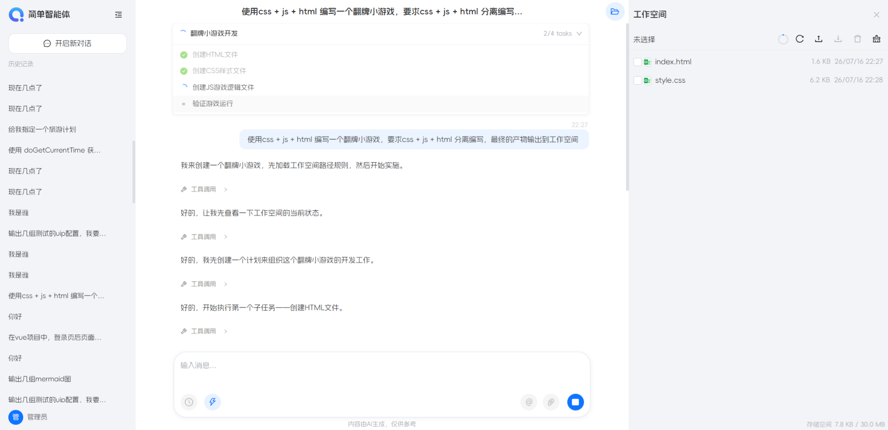 | 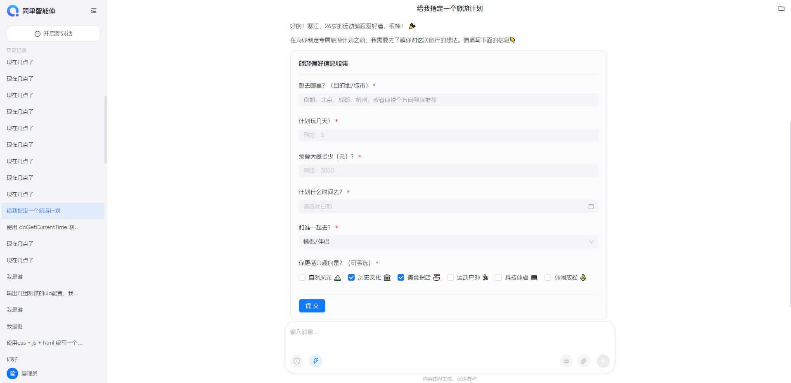 |
| ------------------------------------------------------------ | ------------------------------------------------------------ |
|                                                              |                                                              |
|                | 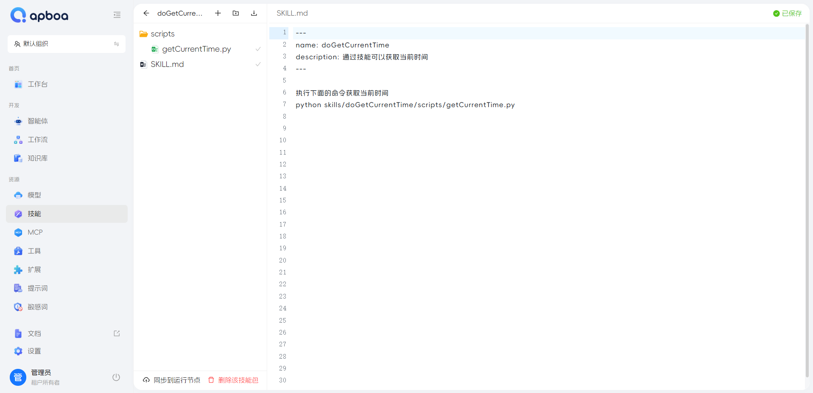 |
| 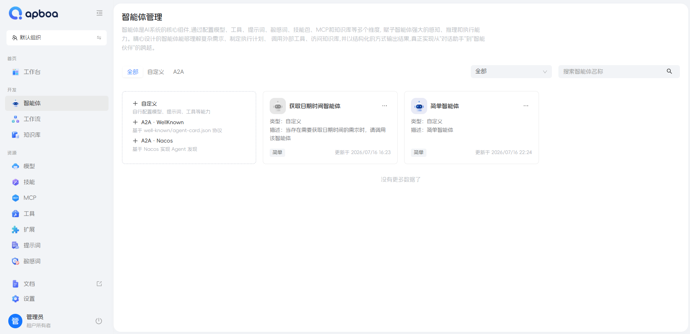 | 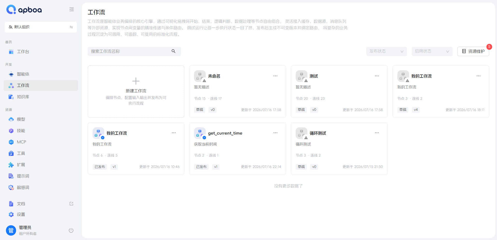 |
| 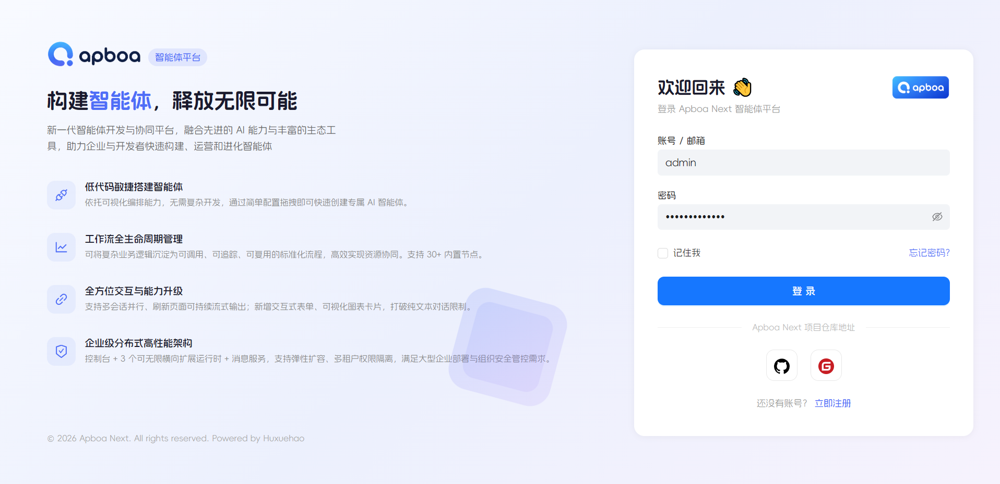 | 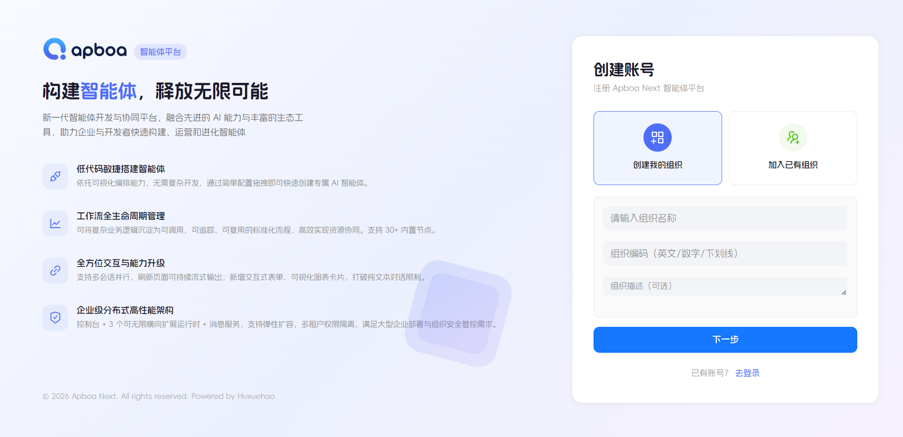 |

|  | 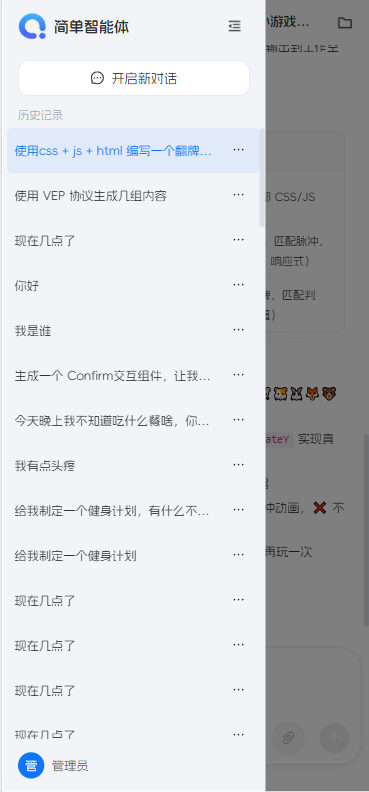 |  |
| ------------------------------------------------ | ------------------------------------------------------------ | ------------------------------------------------ |

| 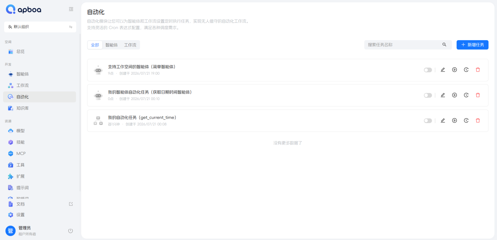 | 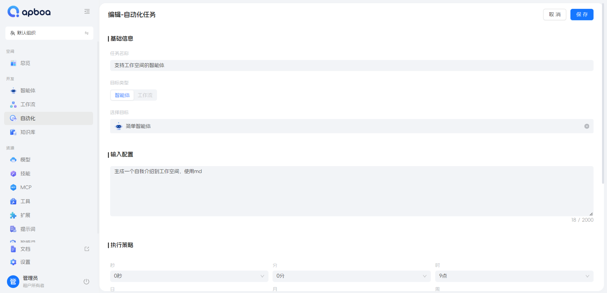 |
| ------------------------------------------------------------ | ------------------------------------------------------------ |
| 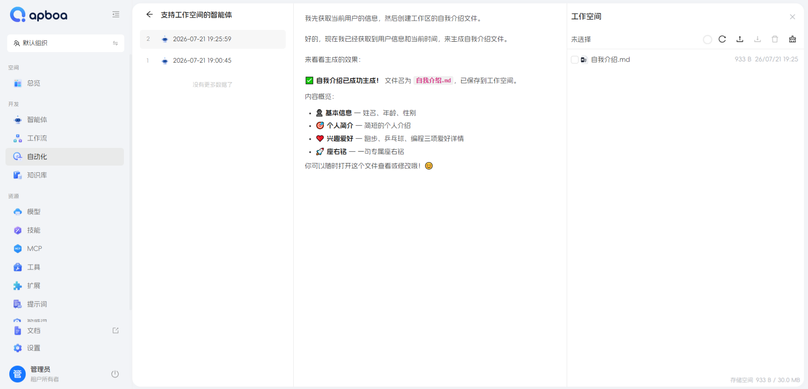 | 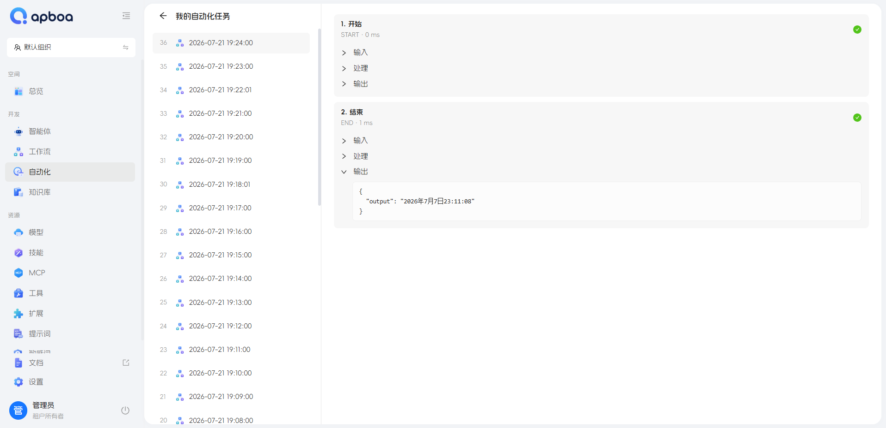 |

| 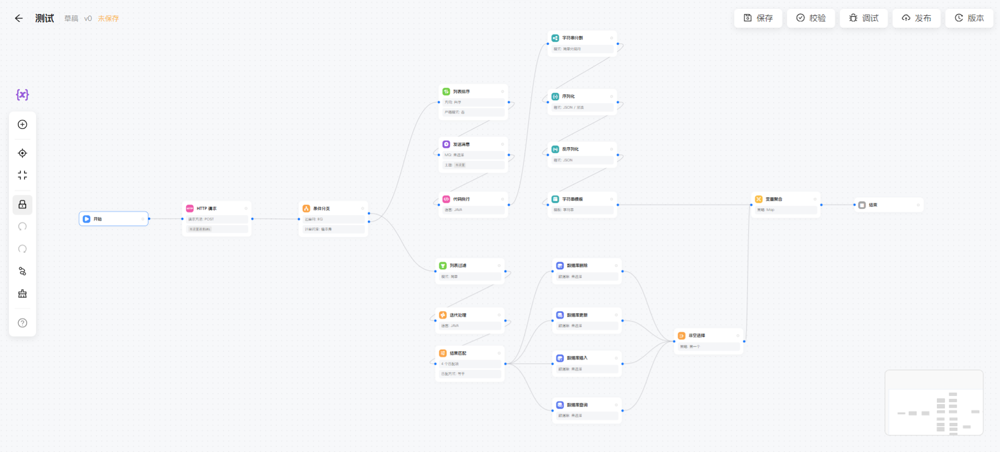 | 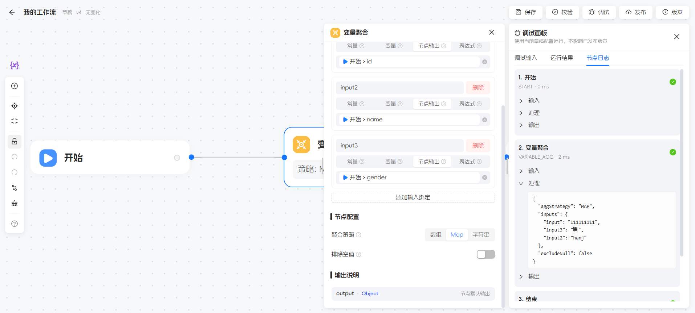 |
| ---- | ---- |

---

## 部署指南

### 开发 / 评估

```bash
cd docker
bash start-simple.sh        # 单机全量部署，约 5 分钟
```

### 生产环境

```bash
cd docker
bash start-middleware.sh    # 中间件服务（Mysql、Redis、向量库）
bash start-console.sh       # 仅管理控制台
bash start-execute.sh       # 分布式部署，Runtime 可独立扩容
```

> [!NOTE]
> 生产部署建议：Runtime 至少 2 实例，MySQL 、 Redis 与 向量库 使用托管服务。

---

## 项目结构

```
apboa-next/
├── common-base/          # 基础层：枚举、常量、工具类、加密
├── common/               # 公共层：Entity、DTO、VO、Wrapper
├── biz/                  # 业务层（16 个扁平化模块）
│   ├── biz-agent/        #   智能体定义 + 会话管理
│   ├── biz-account/      #   账号 + 租户 + 审批
│   ├── biz-mcp/          #   MCP 服务管理 + 运行时降级
│   ├── biz-knowledge/    #   知识库配置
│   ├── biz-skill/        #   技能包管理
│   ├── biz-tool/         #   工具配置
│   ├── biz-hook/         #   Hook 配置
│   ├── biz-model/        #   模型供应商 + 模型配置
│   ├── biz-prompt/       #   系统提示词模板
│   ├── biz-sensitive/    #   敏感词管理
│   ├── biz-resource/     #   附件 + 存储协议
│   ├── biz-params/       #   系统参数
│   ├── biz-a2a/          #   A2A 协议配置
│   ├── biz-studio/       #   Studio 集成
│   ├── biz-sk/           #   密钥管理
│   └── biz-longterm/     #   长期记忆配置
├── engine/               # 引擎层
│   ├── agent/            #   ReAct / A2A 智能体工厂
│   ├── model/            #   多模型供应商适配
│   ├── tool/             #   工具系统 + 动态加载
│   ├── skill/            #   VEP / APIP 内置技能
│   ├── knowledge/        #   多后端知识库工厂
│   ├── mcp/              #   MCP 客户端工厂 + 懒加载
│   ├── memory/           #   记忆管理 + 长期记忆
│   ├── rag/              #   本地 RAG 流水线
│   ├── hook/             #   Hook 生命周期
│   ├── prompt/           #   提示词工程
│   ├── security/         #   脚本安全扫描引擎
│   ├── workspace/        #   工作空间 + 安全校验
│   └── mpatch/           #   代码增量更新器
├── workflow/             # 工作流引擎层
│   ├── node/             #   30+ 节点实现（base/cache/code/condition/db/http/loop/mcp/mq/...）
│   └── workflow/         #   工作流核心（Workflow/Edge/RunWorkflow）
├── scheduler/            # 调度层：Quartz + 分布式锁
├── heartbeat/            # 基础设施：心跳监控
├── runner-console/       # 应用：管理控制台（36 个 Controller）
├── runner-runtime/       # 应用：AI 运行时 + AG-UI 端点
├── runner-proxy/         # 应用：Shell 沙箱
├── runner-file/          # 应用：文件同步
├── runner-websocket/     # 应用：WebSocket 推送
├── ui/                   # 前端：Vue 3 管理界面
├── docker/               # 部署：Docker Compose + Nginx
└── sql/                  # 数据库初始化脚本
```

---

## 贡献指南

我们欢迎任何形式的贡献！请按照以下流程提交 Pull Request：

### 1. Fork 与克隆

在 Gitee 上 Fork 本仓库，然后克隆到本地：

```bash
git clone https://gitee.com/<your-username>/apboa-next.git
cd apboa-next
git remote add upstream https://gitee.com/studious_tiger/apboa-next.git
```

### 2. 创建分支

从 `main` 分支创建你的工作分支，分支命名遵循以下规范：

| 类型 | 分支前缀 | 示例 |
|------|----------|------|
| 新功能 | `feature/` | `feature/mcp-timeout-retry` |
| 缺陷修复 | `fix/` | `fix/react-loop-null-check` |
| 文档更新 | `docs/` | `docs/update-deploy-guide` |
| 重构优化 | `refactor/` | `refactor/vector-store-factory` |

```bash
git checkout -b feature/your-feature-name
```

### 3. 开发与提交

**代码规范：**

- 后端代码遵循项目已有的注释规范（参见类/方法上的 Javadoc）
- 前端代码遵循 ESLint + Prettier 配置
- 新增功能应附带相应的单元测试
- 确保本地 `mvn compile` 和前端 `pnpm build` 通过

**Commit Message 规范：**

采用 [Conventional Commits](https://www.conventionalcommits.org/) 格式：

```
<type>(<scope>): <subject>

[可选的正文]

[可选的脚注]
```

常用 `type`：

- `feat` — 新功能
- `fix` — 缺陷修复
- `docs` — 文档变更
- `refactor` — 重构（非新功能、非修复）
- `perf` — 性能优化
- `test` — 测试相关
- `chore` — 构建/工具链变更

`scope` 为可选的模块名，如 `engine`、`mcp`、`ui`、`docker` 等。

示例：

```
feat(mcp): 添加 MCP 连接超时自动重试机制

- 连续失败 3 次后自动降级
- 支持通过配置调整重试阈值
```

### 4. 提交 Pull Request

- 确保你的分支与上游 `main` 保持同步：

  ```bash
  git fetch upstream
  git rebase upstream/main
  ```

- 推送分支到你的 Fork 仓库后，向本仓库的 `main` 分支发起 Pull Request
- PR 标题遵循 Commit Message 格式，简要描述变更内容
- PR 描述中请说明：**变更动机**、**变更内容**、**测试方式**
- 一个 PR 只做一件事，避免混合多个不相关的变更
- 如果 PR 关联某个 Issue，请在描述中引用

### 5. 代码审查

- PR 提交后将由维护者进行 Code Review
- 请根据审查意见及时修改并推送更新
- 审查通过后由维护者合并到 `main` 分支

> **提示：** 提交前请确保已签署 [贡献者许可协议（CLA）](https://cla-assistant.io/)（如适用），并同意你的贡献遵循本项目的 [MIT](LICENSE) 开源协议。

---

## 交流与赞助

<table>
  <tr>
    <td align="center"><strong>入群交流（备注 apboa）</strong></td>
    <td align="center"><strong>微信赞助</strong></td>
    <td align="center"><strong>支付宝赞助</strong></td>
  </tr>
  <tr>
    <td align="center"></td>
    <td align="center"></td>
    <td align="center"></td>
  </tr>
</table>

---

## 开源协议

[MIT](LICENSE) — Copyright (c) 2026 StudiousTiger

---

<p align="center">
  <sub>如果觉得 Apboa 对你有帮助，请给一颗 Star 支持。</sub>
</p>

---

无论是构建客服助手、创意伙伴还是行业专家，您都无需从零开始。在 Apboa Next 的赋能下，只需通过简单的配置与拖拽，即可将前沿的 AI 能力快速转化为解决实际业务问题的智能体，大幅降低技术门槛与开发周期，真正实现智能应用的随需而创、高效落地。
