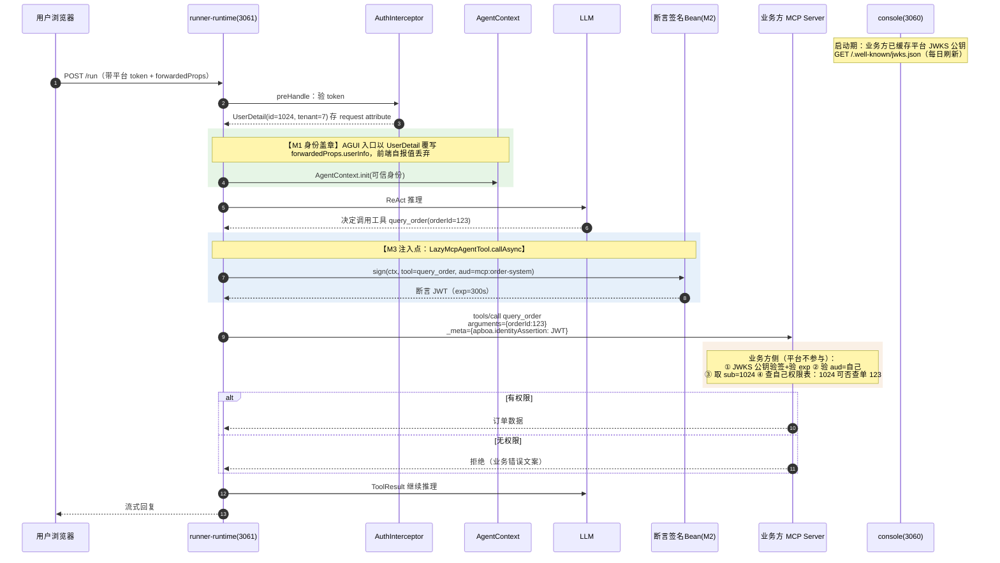

# Apboa 可信身份传递（Identity Propagation）— 设计与执行计划

> **致执行者（下一个 Claude）**：本文档自包含，不需要先前对话上下文。请按顺序通读 §0~§5（定调、现状、选型、目标架构、时序），再进入 §6 逐模块实施。
>
> 文档中所有 `文件:行号` 是撰写时（2026-07-10）的快照，**动手前务必用 `grep`/`Read` 二次核对**。标注约定：✅ = 已用代码/运行时实证确认；⚠️ = 动手时需二次验证。
>
> **v2 更新（2026-07-10）**：初稿的全部 ⚠️ 已逐一读源码核实完毕，结论已回写进各模块（标 ✅v2）。其中两个"不核实必翻车"的实现级事实：
> 1. `AgentContext.init` 运行在 `executorService.submit` 的**异步线程**（`AguiMvcController.java:104-108`）——`RequestHolder`（AuthInterceptor 的 ThreadLocal）在该线程取不到，且 controller 返回后 `postHandle` 立即 `RequestHolder.clear()`。**M1 盖章必须在 controller 同步段提取 UserDetail，闭包传入异步块**。
> 2. chatKey 换 token 时 `UserDetail.id = IdWorker.getId()`（每次随机雪花 id），**不是** agent 主人的真实 userId（绑定的只是租户）——断言 `sub` 在 chatKey 场景的语义是"会话级随机身份"，见 §3.2。
>
> **以下决策已由项目负责人拍板，不要推翻**：
> 1. 平台定调**通用 AI 平台**：不做用户级权限判定（PDP/PEP 全部在业务方系统）；平台唯一不可外包的义务 = **可信身份传递**。
> 2. 技术路线选 **方案 B：平台签名身份断言（Signed Identity Assertion）**。方案 D（明文+网络兜底）跳过不做；方案 C（OAuth Token Exchange / IdP）留作 SaaS 化后的演进位，本期不引入任何 IdP 组件。
> 3. 平台侧 userId 与业务方用户体系的**映射表由业务方维护**，平台不建映射。
> 4. 网页嵌入（chatKey）场景走 **Intercom Identity Verification 模式**：业务方后端用 embed secret 给自己的登录用户签短命 userJwt；平台验签后在断言中**如实转述**（`external_*` 声明）。
> 5. `external_sub` 的真伪由业务方自己背书（断言中以 `external_iss` 标注出处，权责随字段语义走）；平台只背书"这话确实是该业务方说的"。

---

## 0. TL;DR

**做什么**：平台在每次工具调用（MCP / HTTP 工具 / Groovy 动态工具）时，附带一张**平台私钥签名的短命 JWT（身份断言，比喻：介绍信）**，声明"本次调用由认证用户 X（租户 T）发起"。业务方系统用平台 JWKS 公钥验签后，**自行**做权限判定。平台全程零权限逻辑。

**为什么**：agent 目前只有租户级隔离；业务方的 MCP/tool 需要用户级权限，但平台不想内置业务权限模型。权限判定可以外包，**身份的可信传递不能外包**——这是平台唯一必须自建的一环。

**核心改动**（7 个模块，详见 §6）：
1. **M1 身份盖章**（地基）：`AgentContext.userInfo` 从"前端自报"改为"服务端以认证 principal 覆写"。
2. **M2 签名服务 + JWKS**：新增断言签名 bean（RSA/EC 私钥签发短命 JWT）+ console 暴露 `/.well-known/jwks.json`。
3. **M3 MCP 注入**：工具调用时把断言塞进 `CallToolRequest._meta`（SDK 0.17.0 原生支持，✅ 已 javap 实证）。
4. **M4 HTTP/Groovy 注入**：HTTP 型工具加 `Authorization: Bearer` 头；`AgentContext` 暴露 `getIdentityAssertion(audience)` 给脚本。
5. **M5 audience 配置**：`McpServer` 加 `audience` 字段（断言的 `aud` 声明来源）。
6. **M6 嵌入身份**：chatKey 配 `embedSecret`；换 token 接口接收业务方签的 `userJwt`，验签后把 `external_sub/external_iss/external_name` 烙进平台会话 token。
7. **M7 embed.js + 接入文档**：`data-user-jwt` 属性、token 缓存按用户隔离、`reset()`；业务方接入指南（签 userJwt 3 行代码 + MCP 验签规范）。

---

## 1. 背景与第一原理

### 1.1 问题

- agent 平台现有隔离粒度 = **租户级**（agent 绑定工具/MCP 按租户管理）。
- 业务方系统通过 MCP 或自定义工具接入平台后，需要**用户级**权限（同租户内：用户 42 只能查自己的订单）。
- 平台定调通用 AI 平台，**不内置业务权限模型**。

### 1.2 第一原理

任何权限体系 = **身份证据**（谁在调）× **判定点 PDP**（规则谁说了算）× **执行点 PEP**（谁负责拦）。

PDP 和 PEP 外包给业务方是合理分层（平台管**能力面**：agent 能用哪些工具；业务方管**数据面**：用户能碰哪些数据）。但由此推出：

> 平台可以不做权限判定，但**必须做可信身份传递**。若平台既不判权限、又不能把"是谁在调"可信地告诉业务方，业务方要么裸信自报值（形同虚设）、要么拒绝服务。

### 1.3 方案选型摘要（已拍板，此处仅存档结论）

| 维度 | D 明文+网络兜底 | **B 签名断言（选定）** | A 用户凭证透传 | C Token Exchange |
|---|---|---|---|---|
| 平台改造量 | 小 | 中 | 大（MCP 连接模型重构） | 很大（引 IdP） |
| 防伪造强度 | 网络边界即上限 | 强（平台被攻破才破） | 最强 | 最强+可审计 |
| MCP 共享连接保留 | ✅ | ✅（断言走请求级 `_meta`） | ❌ 必须 per-user 连接 | ❌ |
| stdio MCP 适用 | ✅ | ✅ | ❌ | ❌ |
| 匿名/嵌入用户 | ✅ | ✅（`external_sub`/匿名档） | ❌ | ⚠️ 复杂 |
| 长任务 token 过期 | 无此问题 | 无（每次调用现签） | 💣 硬伤 | ⚠️ 需刷新 |

选 B 的决定性理由：与现有架构零冲突（MCP 共享连接不动、无新组件）、复用已有 jjwt 技术栈、对三类工具是同一张断言、嵌入场景可扩展 `external_*`。

---

## 2. 现状实证（身份链路四层，动手前逐条核对）

| 层 | 现状 | 代码依据 |
|---|---|---|
| HTTP 鉴权层 | ✅ **有可信身份**。`AuthInterceptor` 三分支（JWT / SK / chatKey-token）验签后，`UserDetail`（userId/tenantId/tenantCode/tenantRole）存 `request.setAttribute(SysConst.USER_DETAIL, ...)`，租户进 `TenantUtils` ThreadLocal | `common/src/main/java/com/hxh/apboa/common/config/auth/AuthInterceptor.java:168-176`（JWT 分支）、`:246-252`（SK 分支） |
| Engine 执行层 | ❌ **身份自报**。`AgentContext.userInfo` 直接解析前端 forwardedProps（`useChatStream.ts:54` 由前端 Pinia store 塞入），runtime 全程无覆写（✅ 全模块 grep `userInfo` 零命中于 runner-runtime/runner-websocket 的写入路径） | `engine/src/main/java/com/hxh/apboa/engine/agui/AgentContext.java:56-59` |
| MCP 连接层 | ❌ **无用户维度**。连接按 `mcpServerId` 全进程共享（`sharedContexts`），header/queryParams 为 `McpServer.protocolConfig` 静态配置 | `engine/src/main/java/com/hxh/apboa/engine/mcp/McpClientFactory.java:59,148-173`、`common/.../mcp/config/impl/HttpMcpClientConfig.java` |
| 自定义工具层 | 🌓 半通。`DynamicAgentTool.execute(agentContext, params)` 已传 `AgentContext`，但其中 userInfo 是自报值 | `engine/src/main/java/com/hxh/apboa/engine/tool/dynamices/DynamicAgentTool.java:96-98` |

嵌入（chatKey）现状：

- `embed.js` 仅带 `data-chat-key`，iframe src = `/#/communication/{chatKey}?embed=1`，**无任何用户身份通道**（✅ `ui/public/embed.js`）。
- 换 token：`POST /auth/chat-key-token/{chatKey}`，无 body（✅ `runner-console/src/main/java/com/hxh/apboa/console/account/AuthController.java:97-99` → `accountService.chatKeyToken`）。✅v2 换出的 token 绑 **agent 主人的租户**，但 `UserDetail.id` 为每次换 token 随机生成的雪花 id（`IdWorker.getId()`）——外部访客无真实用户身份，仅有会话级随机标识。

关键依赖实证：

- ✅ MCP Java SDK **0.17.0**（`~/.m2/.../io/modelcontextprotocol/sdk/mcp-core/0.17.0/`），`McpSchema$CallToolRequest` 为 record，含 `Map<String,Object> meta` 字段 + 三参构造 + builder（javap 实证）。**`_meta` 注入通道在 classpath 上真实存在。**
- ⚠️ agentscope 的 `McpClientWrapper.callTool(name, input)` 二参签名未透出 meta（`engine/.../mcp/LazyMcpAgentTool.java:130` 调用处）。`McpClientWrapper` 不在仓库内（来自 agentscope jar）。桥接见 §6.M3。
- ✅ 仓库已有**同包路径源码覆盖 agentscope 类**的先例：`runner-runtime/src/main/java/io/agentscope/core/{agui,tool}/...`。
- ✅ jjwt 已在用（`AuthInterceptor` import `io.jsonwebtoken.Claims`；`TokenUtils` 签发/验签）。⚠️ 动手时核对 jjwt 版本是否 ≥0.12（JWK/JWKS builder 支持；若低版本，JWKS 端点手拼 JSON 也可，RSA 公钥 → n/e Base64URL 两个字段的事）。

---

## 3. 目标架构

### 3.1 信任模型（一句话版）

> 平台当**公证处**：每次替用户调业务方系统时附一张"介绍信"（签名断言）——"兹证明本次请求由我平台认证的用户 X（租户 T）发起，有效期 5 分钟，仅限贵司使用"。业务方**验章**（JWKS 公钥）后**自行**决定该用户能干什么。

- 平台背书范围：**只到自己的账号体系为止**（"这是我认证的用户 1024"）。
- 嵌入场景的扩展：断言可携带 `external_*` 声明，语义为"**业务方 X 声称**此人是他家用户 42，我核验过这话确实是 X 说的"（平台验的是 embed secret 签名，不验 42 的真伪）。
- 业务方 MCP 验章时必须**同时验 `aud` 和 `external_iss`**（防跨业务方替身，见 §7 坑 3）。

### 3.2 身份断言（Identity Assertion）规格

JWT（RS256 或 ES256），**每次工具调用现签一张**（签名为内存运算，微秒级），不复用、不缓存。

```json
{
  "iss": "apboa-platform",
  "kid": "<签名密钥标识，JWT header>",

  "sub": "1024",
  "tenant_id": "7",
  "tenant_role": "TENANT_EDITOR",

  "agent_id": "2071495895812374530",
  "thread_id": "th_abc123",
  "tool_name": "query_order",

  "aud": "mcp:order-system",

  "external_iss": "ck-xxx",
  "external_sub": "42",
  "external_name": "张三",

  "anon_id": "an_9f8e7d...",

  "iat": 1752110000,
  "exp": 1752110300,
  "jti": "uuid-xxxx"
}
```

| 字段 | 必带 | 语义 | 来源 |
|---|---|---|---|
| `iss` | ✅ | 固定 `apboa-platform`（可配置） | 配置 |
| `sub` | ✅ | **平台侧** userId（M1 盖章后的可信值）。✅v2 语义修正：chatKey 场景下 `UserDetail.id` 是换 token 时 `IdWorker.getId()` 生成的**会话级随机雪花 id**（非 agent 主人真实 id，绑定的只是租户）——业务方判权限应依据 `external_sub`，`sub` 在该场景仅作会话区分/审计 | `UserDetail.id` |
| `tenant_id` / `tenant_role` | ✅ / 可选 | 租户与租户内角色 | `UserDetail` |
| `agent_id` / `thread_id` | ✅ | 审计溯源（哪个 agent、哪次会话） | `AgentContext` |
| `tool_name` | ✅ | 本次调用的工具名（一信一用） | 调用点 |
| `aud` | ✅ | 目标系统标识（M5 配置）；**业务方必须校验** | `McpServer.audience` |
| `external_iss/sub/name` | 嵌入场景 | 业务方声称的外部用户身份；`external_sub` 仅在 `external_iss` 命名空间内有意义 | 会话 token claims（M6） |
| `anon_id` | 纯匿名场景 | 平台发的访客随机持久标识（限流/会话连续性用，**非身份证明**） | 前端 localStorage |
| `iat/exp` | ✅ | 有效期 **5 分钟（300 秒）**；验签容差（clock skew）建议 30~60 秒 | 签发时 |
| `jti` | 可选 | 唯一编号，业务方可选做 5 分钟重放窗口去重 | 签发时 |

### 3.3 三档身份模型

| 档位 | 断言特征 | 业务方 MCP 典型策略 |
|---|---|---|
| 平台正式用户 | `sub`=真实 userId，无 `external_*` | 按平台侧身份判 |
| 业务方认证访客（嵌入 + userJwt） | `external_sub` + `external_iss` | 按业务方自己权限表判（**核心场景**） |
| 纯匿名访客 | 无 `external_sub`，可有 `anon_id` | 只放公开能力（查天气可以，查订单免谈） |

**匿名档不需要"解决"，只需要"如实声明"**——拒不拒绝是业务方的权限决策，平台的义务止于如实标注。

### 3.4 断言的注入通道（三类工具统一心智）

| 工具类型 | 通道 | 关键性质 |
|---|---|---|
| MCP 工具 | `CallToolRequest._meta`，key = `apboa.identityAssertion` | **平台执行层注入，不经过 LLM**——模型的函数参数里没有这个字段，提示词注入改不到它。MCP 规范对未知 `_meta` key 要求忽略，接第三方 MCP 零副作用 |
| HTTP 型自定义工具 | `Authorization: Bearer <JWT>`（或 `X-Apboa-Assertion`） | ⚠️ 动手时确认 `CodeLanguage` 枚举是否有内置 HTTP 工具类型；若 HTTP 调用都发生在脚本内，则并入下一行 |
| Groovy/脚本工具 | `AgentContext.getIdentityAssertion(audience)` 按需取 | 脚本只能拿到"以当前会话真实身份签好的断言"，**拿不到私钥**（§7 坑 2） |

---

## 4. 完整时序 A：平台正式用户 → MCP 工具调用（方案 B 主线）



要点：

- 盖章（步骤 4-5）发生在**每次 run 的入口**，与后续所有工具调用解耦——一次盖章，本轮所有调用受益。
- 断言（步骤 8-9）**每次工具调用现签**，`tool_name`/`aud` 逐次不同。
- MCP 共享连接（`sharedContexts`）**完全不动**：身份在请求级 `_meta`，不在连接级 header。

## 4bis. 完整时序 B：业务方嵌入页 · 外部用户 42 端到端

```mermaid
sequenceDiagram
    autonumber
    participant EU as 业务方用户42(浏览器)
    participant BF as 业务方前端页面
    participant BB as 业务方后端
    participant EJ as embed.js + iframe
    participant CS as console(3060)
    participant RT as runner-runtime(3061)
    participant SG as 断言签名Bean
    participant MCP as 业务方 MCP Server

    EU->>BB: 登录业务方系统（业务方自己的会话）
    rect rgb(250, 240, 230)
    Note over BB: 【业务方仅两行】用 embed secret 签 userJwt<br/>{sub:"42", name:"张三", exp:+5min}（HMAC-SHA256）
    end
    BB-->>BF: 渲染页面，注入<br/>&lt;script src=".../embed.js"<br/>data-chat-key="ck-xxx"<br/>data-user-jwt="&lt;userJwt&gt;"&gt;
    BF->>EJ: embed.js 初始化
    EJ->>EJ: token 缓存 key 含 userJwt.sub 哈希<br/>（换人自动废弃旧 token，§7 坑 1）
    EJ->>CS: POST /auth/chat-key-token/ck-xxx<br/>body={userJwt}
    rect rgb(230, 245, 230)
    Note over CS: 【M6】验 chatKey（现有逻辑）→<br/>取该 chatKey 的 embedSecret 验 userJwt 签名+exp
    end
    alt userJwt 验签通过
        CS-->>EJ: 平台会话 token<br/>claims 烙入 external_sub=42/external_iss=ck-xxx/external_name
    else 验签失败
        CS-->>EJ: 按配置：拒绝 / 降级纯匿名 token
    else 未带 userJwt
        CS-->>EJ: 纯匿名 token（现状行为，向后兼容）
    end
    EU->>EJ: 在嵌入聊天窗提问"我的订单到哪了"
    EJ->>RT: POST /run（带会话 token）
    RT->>RT: AuthInterceptor 解析 token →<br/>UserDetail(主人身份) + external_sub=42
    RT->>RT: 【M1 盖章】external_* 随可信身份进 AgentContext
    RT->>SG: 工具调用时签断言
    SG-->>RT: JWT{sub=会话随机id, external_iss=ck-xxx,<br/>external_sub=42, aud=mcp:order-system}
    RT->>MCP: tools/call + _meta 断言
    rect rgb(250, 240, 230)
    Note over MCP: 业务方验章 → 验 aud → 验 external_iss=自己发的 chatKey<br/>→ 取 external_sub=42 → 查权限表 → 只返回 42 自己的订单
    end
    MCP-->>RT: 用户42的订单数据
    RT-->>EU: 流式回复
```

要点（信任链闭环）：

- 签小条的密钥（步骤 2）与最终消费身份的权限表（步骤 17）**都在业务方手里**——业务方"自己给自己传身份"，平台是验过章的可信邮差。
- `userJwt` 短命（5 分钟）且只用于换 token 那一下；真正的会话凭证是平台签的 token（不含 embed secret，泄漏也伪造不了新身份）。
- **为什么不能 `data-user-id="42"` 明文传**：HTML 属性是前端明文，访客 F12 改一下即可冒充任意用户 → 权限隔离归零。身份凭证必须在用户碰不到的地方（业务方后端）签发。

---

## 5. 密钥体系

| 密钥 | 持有方 | 用途 | 轮换 |
|---|---|---|---|
| 平台断言私钥（RSA 2048 / EC P-256） | 平台（DB 表或配置，runtime 多实例共享） | 签身份断言 | JWKS 双 kid 并存：新公钥先上 JWKS → 等业务方缓存刷新（≥24h）→ 切私钥 → 旧公钥观察期后摘除。全程不中断 |
| 平台 JWKS 公钥 | 公开（console `GET /.well-known/jwks.json`，`@PassAuth`） | 业务方验章 | 同上 |
| embed secret（每 chatKey 一个，HMAC-SHA256 对称密钥） | 业务方后端 + 平台（chatKey 配置） | 业务方签 userJwt；平台验 | chatKey 管理页支持重新生成；⚠️ 建议支持新旧双活字段（`embedSecret` + `embedSecretPrev`），避免轮换瞬断 |

存储建议（M2 落地形态）：新表 `identity_signing_key`（id/kid/algorithm/private_pem/public_pem/status/created_at），首启无 ACTIVE 密钥则自动生成一条。console 读 public 出 JWKS；runtime 读 private 签名。**私钥绝不进 `AgentContext`、绝不进日志。**

---

## 6. 实施模块与 commit 划分

> 每个模块 = 一个独立可验证、可回滚的 commit（psh 分支按小节 commit 惯例）。顺序即依赖序：M1 是一切的地基；M2 是 M3/M4 的前置；M6/M7 相对独立可并行。

### M1 身份盖章（地基，先行）

**目标**：engine 内的用户身份以服务端认证结果为准，前端自报值失效。

- ✅v2 入口已实证：run/resume 的 HTTP 端点在 `runner-runtime/src/main/java/io/agentscope/spring/boot/agui/mvc/AguiRestController.java`（标准 `@RestController`，run=:87 / runWithAgentId=:112 / resume=:158，**全部标注 `@SkAccess + @ChatKeyAccess`**）→ 委托 `AguiMvcController.handle/handleWithAgentId/handleResume`。三种 token（JWT/SK/chatKey-token）都过 `AuthInterceptor` 且都会 `request.setAttribute(SysConst.USER_DETAIL, ...)`。websocket(3064) 不触发 run（仅心跳/语音通道），run 只有 SSE 一条链。
- ✅v2 **线程约束（关键）**：`AgentContext.init(input, threadId)` 在 `AguiMvcController.handleInternal` 的 `executorService.submit(...)` **异步线程**内执行（`AguiMvcController.java:104-108`）。`RequestHolder` 是 ThreadLocal 且 `postHandle` 会 clear——异步块内**取不到**请求。因此盖章实现为：
  - 在 **controller 同步段**（`AguiRestController` 端点方法内，或 `AguiMvcController.handle*` 入口第一行）从 request attribute 取 `UserDetail` → 构造可信 `AccountVO` → **覆写** `input.forwardedProps.userInfo` → 再进入异步 submit。resume 链路（`handleResume` → `AgentContext.init(agentContext)` 重建路径，`AguiMvcController.java:171,211`）同样处理。
  - 取不到 UserDetail（`@PassAuth` 场景）按匿名处理，**不回退到自报值**。
- ✅v2 字段映射直接：`UserDetail{id,name,username,email,tenantId,tenantCode,tenantRole,tenantName}` → `AccountVO{id,nickname,username,email,tenantRole,...}`（name→nickname）。
- 验证：构造伪造请求（forwardedProps.userInfo.id 填别人的 id）→ 断点/日志确认 AgentContext 内是认证身份。
- commit: `feat(identity): AgentContext 用户身份改为服务端认证覆写，废弃前端自报`

### M2 断言签名服务 + JWKS

**目标**：可用的"公证处"。

- ✅v2 jjwt 版本 **0.13.0**（根 `pom.xml:41`），≥0.12，具备 RSA/EC 签名与 JWK 能力；沿用 `TokenUtils` 同款依赖，无需新增。
- 新增（建议放 `engine` 模块 `com.hxh.apboa.engine.identity` 包）：
  - `IdentitySigningKeyService`：密钥表 CRUD + 首启自动生成 ACTIVE 密钥。
  - `IdentityAssertionSigner`：`String sign(AgentContext ctx, String toolName, String audience)`——组装 §3.2 claims，jjwt 私钥签名。私钥持于 bean 私有字段。
  - console 新 controller：`GET /.well-known/jwks.json`（`@PassAuth`），输出 ACTIVE + 观察期公钥（含 kid）。
- 配置：`iss` 值、断言 TTL（默认 300s）进 application.yml。
- 验证：单测——sign 出的 JWT 用公钥验签、claims 齐全、过期校验生效；curl JWKS 端点格式合规（可用 jwt.io / jose 库互验）。
- commit: `feat(identity): 身份断言签名服务与 JWKS 公钥端点`

### M3 MCP `_meta` 注入

**目标**：MCP 工具调用带断言，业务方 MCP server 可取。

- ✅v2 桥接路线已实证（javap agentscope-core-1.0.12.jar）：`McpClientWrapper` 为**抽象类**，`callTool(String, Map)` 二参抽象方法，未暴露底层 client；实现类共两个：`McpSyncClientWrapper` + `McpAsyncClientWrapper`。→ 采用**同包路径源码覆盖 3 个类**（仓库已有覆盖先例 `runner-runtime/src/main/java/io/agentscope/core/...`）：抽象类加三参 `callTool(name, args, meta)`（可为 default 抛 UnsupportedOperation + 两实现类覆写），实现内部构造 `new CallToolRequest(name, arguments, meta)`（✅ 0.17.0 三参构造已 javap 实证）。**覆盖类文件头注释标明来源版本 agentscope 1.0.12，升级时 diff 同步**。
- 注入点：`engine/.../mcp/LazyMcpAgentTool.java` `callOnce(param)`（撰写时 :128-137，`client.callTool(getName(), param.getInput())` 处）——✅v2 `ToolCallParam` 上下文可达性同 `DynamicAgentTool` 模式：`param.getContext().get(AgentContext.class)`。签发断言 → `_meta` key `apboa.identityAssertion`。
- **audience 缺省行为（负责人已拍板）：未配置 audience 的 MCP server 不注入断言。**
- 验证：本地起一个 20 行 demo MCP server（node/python），打印收到的 `_meta` → 验签通过、claims 正确；未配 audience 的 server 确认不带 `_meta` 断言。
- commit: `feat(identity): MCP 工具调用注入身份断言(_meta)`

### M4 脚本工具的断言获取口子（✅v2 范围缩小）

- ✅v2 已实证：`CodeLanguage` 枚举只有 `{JAVA, JAVASCRIPT}`，**不存在内置 HTTP 工具类型**；loader 仅 `GroovyToolInstanceLoader`（JAVA 类型 = GroovyClassLoader 引擎）。动态工具的 HTTP 调用全发生在脚本代码内 → 本模块只做"给脚本一个取断言的口子"，无独立的 HTTP header 注入路径。
- `AgentContext` 新增 `getIdentityAssertion(String audience)`：内部委托 `IdentityAssertionSigner`（bean 经静态持有或 ToolExecutionContext 注入，⚠️ 桥接方式动手时定，倾向 ToolExecutionContext——`ReActAgentHelper` 已有 `ToolExecutionContext.builder().register(AgentContext.get())` 先例）。**只暴露"给我一张签好的断言"，绝不暴露私钥/Signer 内部。** 脚本自行把断言放进自己发起的 HTTP 请求头（接入文档给示例）。
- 验证：Groovy 测试工具调 `getIdentityAssertion` 取到可验签 JWT；确认脚本反射摸不到私钥字段（结合 §7 坑 2 的隔离约定）。
- commit: `feat(identity): 动态工具与脚本的身份断言获取通道`

### M5 audience 配置

- `McpServer` 实体 + 表加 `audience` 列（如 `mcp:order-system`）；MCP 管理页表单加字段（可选填）。
- （可选，二期）`ToolConfig` 同理；Groovy 场景 audience 由脚本调用方自己传。
- 验证：配置后断言 `aud` 正确；不配置走 M3 评审定的默认行为。
- commit: `feat(identity): McpServer 增加 audience 配置`

### M6 chatKey 嵌入身份（userJwt → external_*）

- ✅v2 chatKey 存储已实证：实体表 **`agent_chat_key`**（`common/.../entity/AgentChatKey.java`：tenantId/agentCode/chatKey）→ 加 `embedSecret` + `embedSecretPrev`（双活轮换）两列 + 管理页"生成/轮换"按钮。
- ✅v2 换 token 链路已读透（`biz-account/.../AccountServiceImpl.chatKeyToken`）：JdbcTemplate 绕租户过滤查 chat_key → 查 agent + tenant → 构造 `UserDetail`（**id=IdWorker.getId() 随机雪花**，username=agentCode，tenantId/tenantCode）→ `TokenUtils.createToken(chatKey, userDetail, 永不过期)`（id 参数=claims.id，subject=UserDetail 的 JSON）→ Redis `login:{token}`。
- ✅v2 **external_* 透传机制**（此发现让 M6 大幅简化）：`UserDetail` 就是 token 的 subject JSON，且 `AuthInterceptor` 解析后原样放 request attribute → **给 `UserDetail` 加 `externalSub/externalIss/externalName` 三个字段即可全链自动透传**（换 token 时写入 → token 携带 → 每次请求解析带出 → M1 盖章进 AgentContext），无需动 TokenUtils/AuthInterceptor。
- `AuthController.chatKeyToken`（`runner-console/.../AuthController.java:97`）加可选 body `{userJwt}`：
  - 无 userJwt → 现状行为（纯匿名，向后兼容）。
  - 有 → 用该 chatKey 的 embedSecret（新旧双验）HMAC 验签 + 验 exp → 通过则把 external_* 写入 UserDetail；失败 → 拒绝（403，文案区分"签名无效/已过期"）。
- 验证：带合法 userJwt 换 token → 工具断言含 external_sub；改 userJwt 任一字符 → 换 token 403；不带 → 断言无 external_*。
- commit: `feat(embed): chatKey 嵌入身份验证(embedSecret+userJwt)与 external 声明透传`

### M7 embed.js + 业务方接入文档

- ✅v2 iframe 内换 token 位置已实证：`ui/src/api/auth.ts:85` `chatKeyToken()` ← 调用方 `ui/src/views/Communication/ChatWrapper.vue`（`/#/communication/{chatKey}` 路由组件）。
- **userJwt 传递方式（负责人已拍板）：postMessage**（不走 URL hash，避免凭证进浏览器历史/日志）。握手：iframe 内 ChatWrapper 加载后向 parent postMessage "ready" → embed.js 收到后以 `targetOrigin=平台源` 回发 userJwt → ChatWrapper 校验 `event.origin` 为宿主页源后携带 userJwt 调 `chatKeyToken`。双向 origin 校验都要做。
- `ui/public/embed.js`：
  - 新增 `data-user-jwt` 属性 → 经上述 postMessage 握手传入 iframe。
  - token 缓存 key 纳入 userJwt.sub 哈希（换人自动重新换 token，§7 坑 1）。
  - 暴露 `window.apboaEmbed.reset()`（业务方登出时调用，清 token 缓存 + 重载 iframe）。
- 新文档 `docs/identity-integration-guide.md`（业务方视角）：
  - 后端签 userJwt 示例（node/java 各 3~5 行）。
  - MCP 验签规范：JWKS 拉取与缓存、验 `exp`（容差 30~60s）、**必须验 `aud`**、**必须验 `external_iss` 是自己的 chatKey**、`external_sub` 命名空间语义、三档身份的建议策略、（可选）`jti` 重放去重。
  - 换人/登出必须 `reset()` 的加粗警告。
- 验证：本地静态页嵌入 → 三档身份各跑一轮（见 §8 验收清单）。
- commit: `feat(embed): embed.js 用户身份传递与业务方接入文档`

---

## 7. 安全边界与已知坑（评审重点）

1. **换人不换 token（串身份，最易踩）**：会话 token 里 `external_sub` 烙死；同浏览器业务方用户 42 登出 44 登入，若复用旧 token 即串号。**解法**：M7 的缓存 key 带 sub 哈希 + `reset()` API + 文档加粗。
2. **Groovy 无沙箱 vs 签名私钥**（项目既有背景：Groovy 动态工具无进程内沙箱，engine 跑在 runtime 容器内）：私钥只存 `IdentityAssertionSigner` 私有字段与 DB；`AgentContext` 只暴露"取签好的断言"；脚本能拿到的最多是**以自己会话真实身份**签的断言（本来就该有），冒充他人无门。配合 runtime 容器基础隔离（cap_drop ALL + no-new-priv + 非 root）够用；更狠的外移签名进程**本期不做**。
3. **跨业务方替身**：业务方 A 的 MCP 若只看 `external_sub` 不看 `external_iss`，业务方 B 的用户 42 调到 A 时会被当成 A 家的 42。**`external_sub` 仅在 `external_iss` 命名空间内有意义**——接入文档必须把"同时验 aud + external_iss"写成硬性规范（M7）。
4. **embed secret 泄漏半径**：攻击者可伪造**该业务方**任意用户的小条；但断言里 `external_iss` 标明出处，其他业务方/平台自身/其他租户无碍。按 chatKey 隔离 + 双活轮换兜底。
5. **时钟偏移**：断言 TTL 仅 300s，业务方服务器时钟偏差会误杀。验签规范写明容差 30~60s（jjwt/jose 均有 clockSkew 参数）。
6. **`_meta` 与第三方 MCP**：MCP 规范要求忽略未知 `_meta` key —— 给不认识断言的第三方 server 带上也零副作用。未来正经接三方生态（需要对方主动认证我们）再升级方案 C。
7. **@PassAuth 端点的断言**：无认证 principal 的调用（若存在这类 run 入口）不得伪造 sub —— 按纯匿名档签（只有 anon_id），或不签。M1 实现时明确。

---

## 8. 端到端验收清单（全绿才算完）

- [ ] 正式用户对话调 MCP：demo server 收到 `_meta` 断言，JWKS 验签通过，`sub` = 登录 userId，`aud`/`tool_name` 正确。
- [ ] 伪造请求（forwardedProps.userInfo 填他人 id）：断言 `sub` 仍为认证身份（M1 盖章生效）。
- [ ] 断言过期（等 >300s 后重放给 demo server）：验签拒绝。
- [ ] 嵌入 + 合法 userJwt：断言含 `external_sub=42, external_iss=ck-xxx`。
- [ ] 嵌入 + 篡改 userJwt（改一个字符）：换 token 403。
- [ ] 嵌入无 userJwt：换 token 成功（向后兼容），断言无 `external_*`。
- [ ] 换人场景：同浏览器 userJwt.sub 变化 → 自动重新换 token，断言 external_sub 跟随。
- [ ] Groovy 脚本 `getIdentityAssertion()`：取到可验签断言；无法触达私钥。
- [ ] JWKS 轮换演练：双 kid 并存期间，新旧私钥签的断言都能被 demo server 验过。
- [ ] MCP 共享连接行为不回归：多用户并发调同一 MCP server，连接仍按 serverId 复用（日志/连接数确认）。

## 9. 未来演进（存档，本期不做）

- **方案 C（OAuth 2.1 Token Exchange）**：SaaS 化、接第三方 MCP 生态、或客户有企业 IdP 时引入。断言体系与其兼容——届时 `IdentityAssertionSigner` 的产物换成 IdP 换出的下游 token，注入通道（`_meta`/header）不变。
- **`jti` 重放硬校验**、**签名外移独立进程**：威胁模型升级（公网多租户 SaaS）时再评估。
